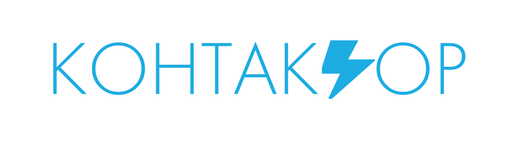

<p align="center">
   
</p>


<h4>Реализованная функциональность</h4>
<ul>
    <li>Получение всех мероприятий с сервера;</li>
    <li>Визуализация основных страниц приложения;</li>
</ul> 
<h4>Особенность проекта в следующем:</h4>
<ul>
 <li>Инструмент мотивацией резидентов участвовать в развитии кластера, как творческого пространства, а также для объединения между собой;</li>
 <li> Удобный интерфейс даже для обычных пользователей, которые могут просматривать и участвовать в мероприятиях кластера;</li>
 </ul>
<h4>Основной стек технологий:</h4>
<ul>
	<li>HTML, CSS, JavaScript, TypeScript.</li>
	<li>CSS in JS</li>
	<li> Webpack, Babel.</li>
	<li>БЭМ.</li>
	<li>React (Next.js), Vue (Nuxt.js), Angular.</li>
	<li>Git, Mercurial.</li>

 </ul>
<h4>Демо</h4>
<p>Демо сервиса доступно по адресу: https://vigorous-kepler-558aac.netlify.app </p>
<p>Реквизиты тестового пользователя: email: их нет(можно войти по кнопке, не заполняя логинформу)</b></p>


СРЕДА ЗАПУСКА
------------
1) развертывание сервиса производится на любой платформе, где установлен npm;
2) требуется установленный web-сервер с поддержкой npm(последняя версия);


Развертывание React
------------
### Для запуска дев версии приложения выполните

Установите зависимости
~~~
npm i
~~~

Разверните приложение зависимости
~~~
npm run start
~~~


### Для запуска прод приложения выполните

Установите зависимости
~~~
npm i
~~~

Установите serve

````
npm install -g serve
````

Соберите приложение и поднимите его

```
npm run build
serve -s build
```


РАЗРАБОТЧИКИ

<h4>Тарапатина Екатерина Сергеевна fullstack https://vk.com/ekaterina028 </h4>

